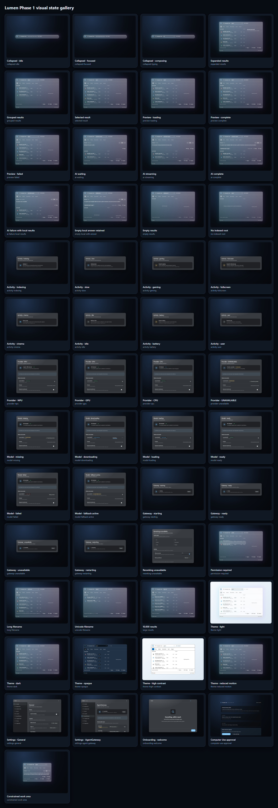

# Lumen

Lumen is a keyboard-first Windows 11 search and browser-agent experience built with Tauri 2, React 19, TypeScript, StyleX, React Aria Components, and Motion. It combines confined local-file search, local/cloud answers behind AgentGateway, and an explicitly consented Gemini Computer Use mode for browser-only tasks.



## Phase-one product

- Persistent borderless native window with Acrylic, Mica, Blur, and opaque fallbacks.
- Global `Alt+Space` invocation, single-instance redirection, active-monitor placement, and hide-on-close lifecycle.
- Collapsed launcher and expanded search workspace with scopes, filters, stable selection, action bar, virtualized 10,000-result handling, and responsive preview.
- Keyboard-complete search, details, open, containing-folder, settings, onboarding, and dialog flows.
- Eight-scene onboarding and ten settings pages covering appearance, roots, search, local AI, AgentGateway, Computer Use, activity, privacy, and diagnostics.
- Light, dark, opaque, reduced-effects, reduced-motion, and forced-colors/high-contrast presentation.
- Typed local-file search, metadata, preview, and opener commands confined to user-selected roots.
- A supervised Gemini Computer Use sidecar that controls a fresh Microsoft Edge context, pauses model-requested sensitive actions for approval, and stops with Lumen.
- Development-only 46-scenario visual gallery, screenshot set, contact sheet, interaction recordings, accessibility/DPI suites, and a strict high-refresh profiler.

The normal Tauri application always uses the real local-file adapter. Deterministic memory data is available only to development tests, recordings, and gallery routes.

## Requirements

- Windows 11 with the Microsoft Edge WebView2 Runtime.
- Bun 1.3 or newer.
- Rust stable with the MSVC target.
- Visual Studio 2022 or Build Tools with Desktop development with C++ and the Windows SDK.
- Python 3.11 (directly or through `uv`) when staging the Computer Use sidecar from source; installed applications include the compiled worker.

Install dependencies and start the native development app:

```powershell
bun install
bun run stage:sidecars
bun run tauri dev
```

The first run asks for one development search root. Press `Alt+Space` from another application to reopen the warm launcher.

## Verification and evidence

```powershell
bun run typecheck
bun run lint
bun run test
bun run test:e2e
bun run profile
bun run capture:gallery
bun run record:interactions
bun run tauri build
```

Rust validation runs from `src-tauri` inside a Visual Studio developer shell:

```powershell
cargo fmt --all -- --check
cargo clippy --all-targets --all-features -- -D warnings
cargo test --all-features
```

Generated evidence is checked in under `artifacts`:

- `artifacts/screenshots/contact-sheet.png` and `manifest.json`: all 46 deterministic states.
- `artifacts/recordings/manifest.json`: four silent WebM interaction studies.
- `artifacts/performance/profile-summary.json`: machine-readable budgets, measurements, burst guards, browser version, and source SHA.
- `artifacts/performance/interaction-trace.zip`: Playwright trace for the measured interaction run.

The MSI and NSIS bundles are generated under `src-tauri/target/release/bundle`. Build outputs are not committed.

## Architecture

- `src/app`: composition, startup, route boundaries, and providers.
- `src/design-system`: semantic tokens, themes, material, icons, type, primitives, and motion.
- `src/features`: launcher, results, preview, onboarding, settings, activity, gateway, local-AI, diagnostics, and gallery surfaces.
- `src/services`: search, answer, Computer Use, and settings contracts plus native, browser, deterministic, and unavailable adapters.
- `src/platform`: Tauri/window abstractions.
- `src-tauri/src`: native window lifecycle and confined local-file commands.
- `tests/e2e`: keyboard, accessibility, DPI, visual, responsive, and performance acceptance.
- `docs/architecture`: design, motion, shell, management, and search-service boundaries.
- `docs/reports`: accessibility, DPI, high-refresh, and phase-one validation evidence.

Start with [the Computer Use architecture](docs/architecture/computer-use.md), [the search-service boundary](docs/architecture/search-service.md), and [native shell architecture](docs/architecture/native-shell.md).

## Security and scope boundary

Local search commands canonicalize every root and requested path. Paths outside a selected root are rejected, symlinks are not followed, generated dependency/build directories are skipped, text previews are capped at 64 KiB, image previews at 4 MiB, and binary text is not returned to the webview. The Tauri capability does not grant shell execute or spawn permissions.

The webview cannot launch arbitrary processes, contact Gemini directly, or read provider credentials. Computer Use accepts only a typed task request, approval responses, and cancellation through Rust IPC. The task, visited page URLs, and browser screenshots leave the device only after explicit consent; the Gemini key is read from Windows Credential Manager and passed directly to the fixed worker process.
